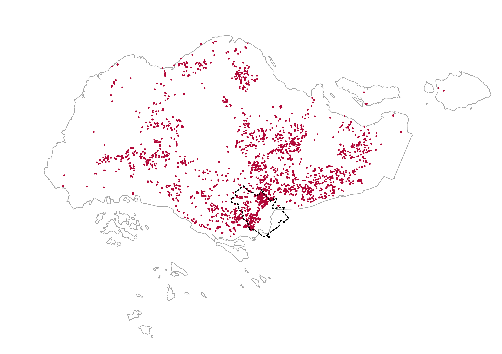
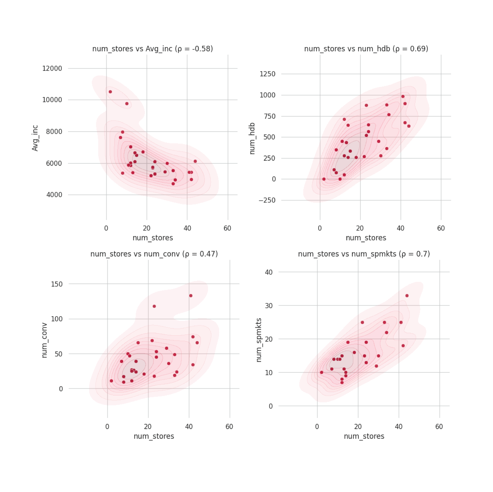
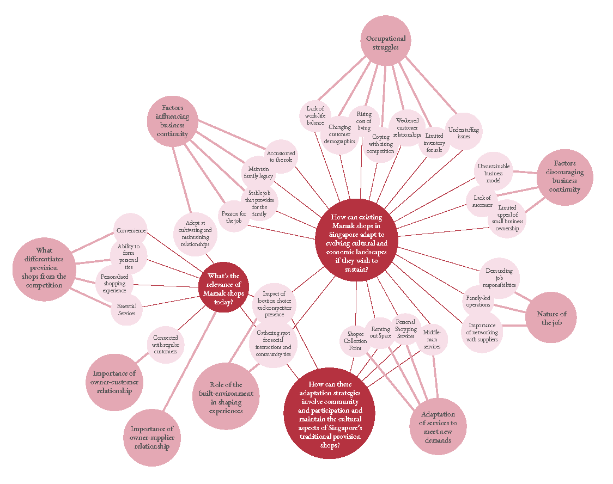

# Resume

### Education
MSc in Architecture, Urbanism and Building Sciences (Landscape Architecture)

  

    <em>Technische Universiteit Delft</em>
  

  

    <em>2022 – 2022</em>
  

 

### Research Experience

  

    <em>Singapore University of Technology and Design (SUTD)</em>
  

  

    <em>2024 – Presesnt</em>
  

 
- The Modern Mamak: Exploring the New Socio-spatial Roles of Mamak Shops in Modern Singapore
  - Led the research project through the exploritory data (EDA) analysis phase, literature review, fieldwork and results analysis.
  - Specialised in GIS and Spatial Data Science for analysis and research, including mapping and quantitative analyses of traditional provision shops in Singapore
  - Organised participatory sessions with shop owners, interviews with local communities to gain and surveys for the general public to decide how mamak shops should be preserved or re-adapted
  - Presented project at the 56th Environmental Design Research Association (EDRA) conference
- Activating Underused Left-over Public Spaces (VIASTA)
  - Organised participatory workshops for residents to give new meaning to a neglected space within the Changi Simei resdiential district
  - Worked with community to transform underused spaces within residential areas into a vibrant fiesta championing sustainability and care
  - Co-presented the project at the 56th Environmental Design Research Association (EDRA) conference
- Good Public Spaces
  - Led the mapping of public spaces based on government datasets and remote sensing and preliminary exploratory data analysis (EDA) phase
- Providing assistance in other projects through:
  - Quantitative Analyses
  - GIS: Mapping and Remote sensing
  - Literature reviews

### Conference Presentations
Lorem ipsum

# Research Projects

  

    
    <a href="https://urbanjeans.github.io/dfn-dashboard" target="_blank">Good Public Spaces: Mapping natural habitats in Singapore with remote sensing and government datasets</a>
  

  

    
    <a href="https://github.com/urbanjeans/mamak-mapper" target="_blank">The Modern Mamak: mapping mamak shops since the 1980s</a>
  

  

    
    <a href="https://urbanjeans.github.io/dfn-dashboard" target="_blank">The Modern Mamak: Exploritory Data Analsyis (EDA) of mamak shops in Singapore</a>
  

  

    
    <a href="https://urbanjeans.github.io/dfn-dashboard" target="_blank">The Modern Mamak: Preliminary analysis of interviews and shop owners' participation</a>
  

